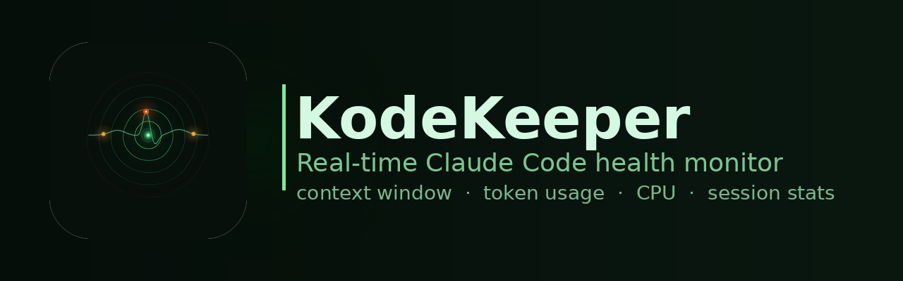
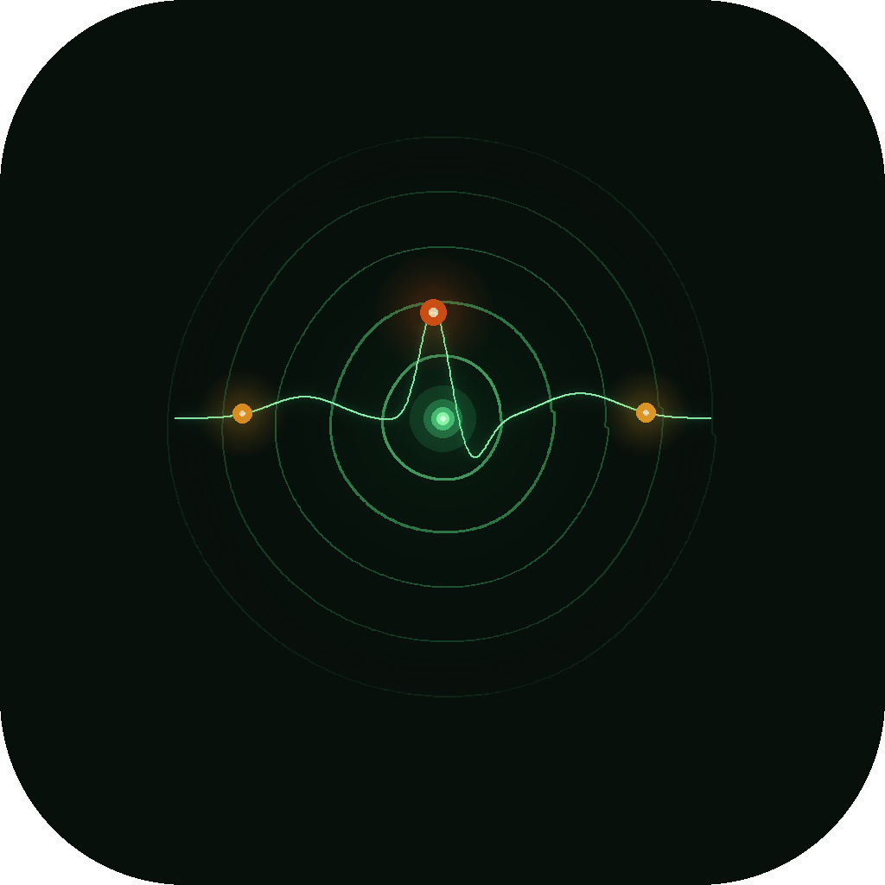

<div align="center">
  
</div>

<br>

<div align="center">
  
  <h1>Kode Keeper</h1>
  <p><strong>Mission control for every Claude Code session you run.</strong></p>
  <p><sub>by <a href="https://github.com/papjamzzz">papjamzzz</a> &nbsp;·&nbsp; Real-time Claude Code health monitor</sub></p>
</div>

<br>

A hardware synthesizer-inspired dashboard that monitors your AI coding sessions in real time. Context window health, token burn rates, cost tracking, live project status, and git — all in one rack.

---

## The Problem

Claude Code is running. You're building. But what's actually happening? How full is your context? How much have you spent today? Which of your apps are live? Is your git clean?

Kode Keeper answers all of it, continuously, without you having to ask.

---

## The Rack

Five modules. One instrument.

**Context Oscilloscope**
Animated waveform of your context window fill over time. Color shifts from grass green → amber → orange → warm red as the window fills. Glows. Breathes. Tells you when to start a new session before you hit the wall.

**Usage VU Meters**
Three vertical audio-level bars — Day / Week / Month. Token counts animate like a mixing board. Peak-hold tick marks. The way CPU meters should look if CPU meters were honest.

**Cost Tracker**
Running USD estimates for today, this week, and this month. Model-aware pricing. You'll know your burn rate before your invoice does.

**Project Patch Bay**
Every app in your stack laid out like a modular patch bay. Online/offline LED per port. Git branch and clean/dirty state per project. Click to open.

**Git Status Rack**
All your repos. Branch, status, last commit. One row per repo. Green dot = clean. Amber = uncommitted changes.

---

## Features

- 🟠 **Orange LED power button** — toggles browser auto-open on/off. Defaults to always on. Persists across restarts.
- 📡 **Live polling** — refreshes every 6 seconds without a page reload
- 🎛 **Organic color palette** — warm grass greens, orange-hued reds, no clinical colors
- ⌚ **Live clock** — ticks independently of the server
- 🎯 **Session timer** — how long the current Claude Code session has been running

---

## How It Works

```
Claude Code (running in terminal)
  └── statusline-command.sh (fires on every update)
        writes context %, model, token counts, session start
              ↓
        ~/.claude/usage/totals.json
              ↓
        tracker.py — reads usage, pings ports, checks git
              ↓
        Flask /api/status (port 5560)
              ↓
        Dashboard — oscilloscope, VU meters, cost, patch bay, git rack
```

---

## Requirements

- macOS
- Python 3.9+
- Claude Code running (for live context data)

---

## Quick Start

```bash
git clone https://github.com/papjamzzz/kodekeeper.git
cd kodekeeper
```

**Option 1 — Double-click launcher (Mac)**
Double-click `launch.command` in Finder. Sets up everything on first run, opens browser automatically.

**Option 2 — Terminal**
```bash
make setup    # creates venv, installs dependencies
make run      # starts at http://localhost:5560
```

---

## Color Language

| Color | Meaning |
|-------|---------|
| 🟢 Grass green `#7ecb52` | Clean, healthy, online, good |
| 🟠 Orange `#ff8c3a` | Power, active state, Ableton accent |
| 🟡 Amber `#f5c842` | Watch — context filling, uncommitted changes |
| 🔴 Warm red `#ff5c38` | Alert — reset now, stop loss hit |

Organic. Modern. No clinical colors.

---

## Stack

- Python + Flask, port 5560, localhost only
- Vanilla JS — no frameworks
- JetBrains Mono + Inter
- Canvas API for the oscilloscope

---

## Part of the Suite

| App | Port | What It Does |
|-----|------|-------------|
| Launcher | 5554 | Hub for all apps |
| [Kalshi Edge](https://github.com/papjamzzz/kalshi-konnektor) | 5555 | Prediction market edge detection |
| [StreamFader](https://github.com/papjamzzz/Stream-Fader) | 5556 | Streaming content ranker |
| [TrackTracks](https://github.com/papjamzzz/Track-Tracks) | 5557 | Per-track Ableton CPU monitor |
| [DAW Doctor](https://github.com/papjamzzz/Daw-Doctor) | 5558 | Ableton Live diagnostics |
| [KK Trader](https://github.com/papjamzzz/kalshi-trader) | 5559 | Autonomous Kalshi trading engine |
| Kode Keeper | 5560 | Claude Code mission control ← you are here |

---

*Built with Claude Code.*
