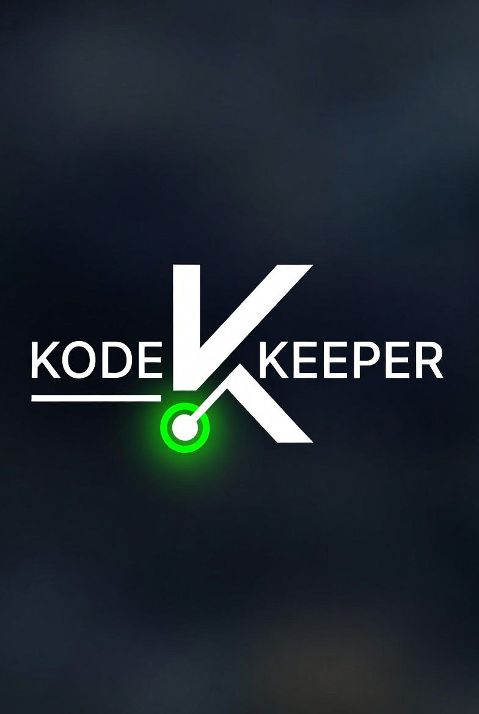

<p align="center">
  
</p>

# Kode Keeper — Mission Control

**Real-time monitoring for every Claude Code session you run.**

One dashboard. Every project. Live.

---

## What It Does

- **Context Window** — animated fader showing how full your window is before it's too late to reset
- **Token Burn** — day / week / month usage, visualized like a mixing board VU meter
- **Cost Tracker** — running USD estimates with model-aware pricing
- **Project Patch Bay** — every app in your stack, online/offline LEDs, git branch, one-click open
- **Git Status** — all your repos at a glance: branch, last commit, clean or dirty
- **Bot Health** — live heartbeat monitoring for autonomous trading bots and background services
- **Call on Claude** — direct line to Claude from the dashboard. Context-aware suggestions, streaming chat, command execution.

---

## Call on Claude

Hit the orange **Call on Claude** button in the top bar to open a live Claude panel:

- **3 dynamic suggestions** generated fresh each time based on your live project state
- **Chat input** — ask anything about your codebase or session
- **Streaming responses** — letter-by-letter, live
- **Command execution** — Claude suggests terminal commands; you approve and run from the panel

---

## Setup

```bash
git clone https://github.com/papjamzzz/kodekeeper.git
cd kodekeeper
cp .env.example .env
# Add your ANTHROPIC_API_KEY to .env
make setup
make run
```

Opens at `http://127.0.0.1:5560`

Or double-click `launch.command` on Mac.

---

## Environment Variables

| Variable | Required | Description |
|----------|----------|-------------|
| `ANTHROPIC_API_KEY` | Yes | Powers Call on Claude |

---

## Dashboard Instruments

| Instrument | What It Shows |
|------------|--------------|
| Context Oscilloscope | Context window fill % with animated fader |
| Usage VU Meters | Token counts — day / week / month |
| Cost Tracker | Running USD cost estimate |
| Project Patch Bay | Online/offline status for all apps |
| Git Status Rack | Branch, last commit, clean/dirty for all repos |
| Bot Monitor | Heartbeat + trade stats for autonomous bots |

---

## Stack

Python · Flask · Vanilla JS · JetBrains Mono · Inter

No external UI frameworks. Runs local. Your data never leaves your machine.

---

## Color Language

| Color | Meaning |
|-------|---------|
| `#00a651` Green | Healthy, clean, online |
| `#ff8c3a` Orange | Active, power, Call on Claude |
| `#f5c842` Amber | Watch — filling up, uncommitted |
| `#ff5c38` Red | Alert — reset now, critical |

---

## Part of Creative Konsoles

Kode Keeper is built for Claude Code power users running AI at scale.

| Tool | What It Does | Port |
|------|-------------|------|
| [Launcher](https://github.com/papjamzzz/launcher) | Hub for all apps | 5554 |
| [Kalshi Edge](https://github.com/papjamzzz/kalshi-konnektor) | Prediction market edge detection | 5555 |
| [KK Trader](https://github.com/papjamzzz/kalshi-trader) | Autonomous trading bot | 5559 |
| **Kode Keeper** | Claude Code mission control | 5560 |
| [5i](https://github.com/papjamzzz/5i) | Parallel AI synthesis engine | 5562 |

---

Built by [Creative Konsoles](https://creativekonsoles.com) — *tools built using thought.*

**[@papjamzzz](https://github.com/papjamzzz)** &nbsp;·&nbsp; support@creativekonsoles.com
